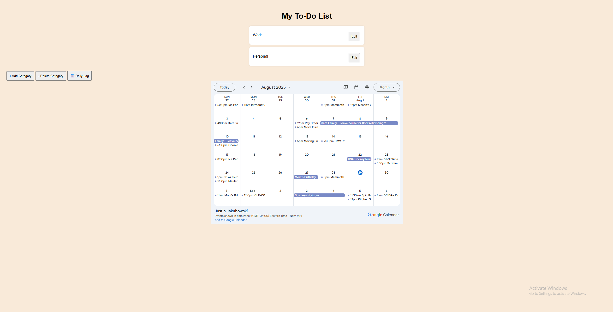
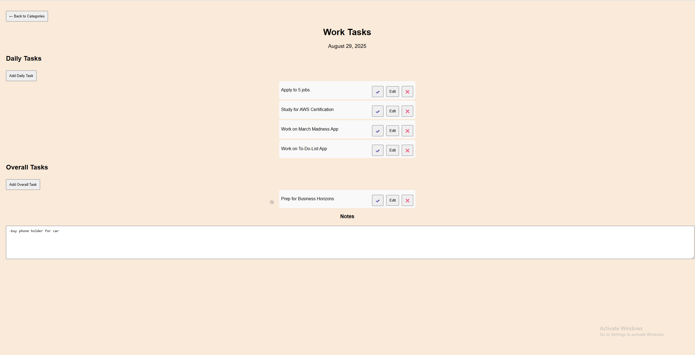
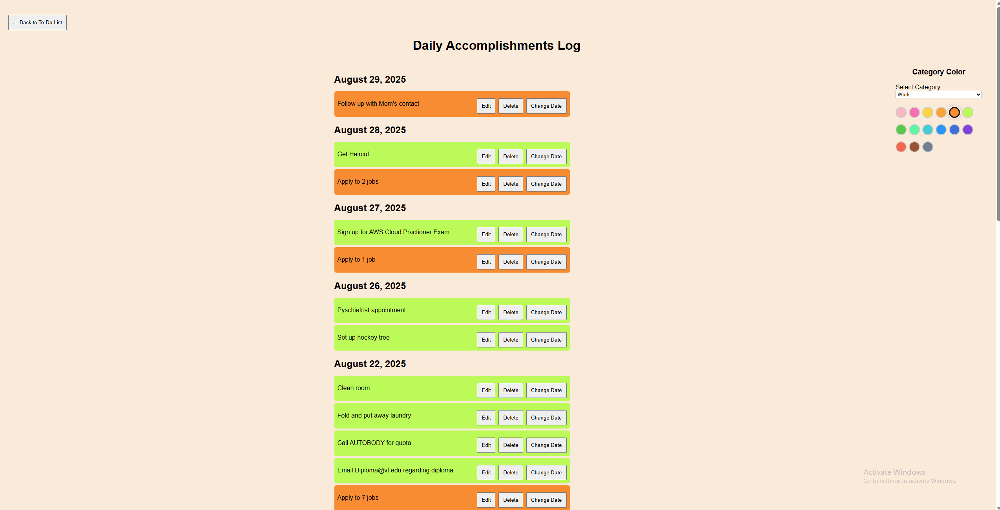

# 📝 Task Manager
*A simple web-based To-Do List application to help you organize tasks and categories.*

---

## ✨ Features  
- ➕ Add, edit, and delete tasks  
- 🗂️ Organize tasks by category  
- 📅 View daily logs  
- 📱 Responsive design for desktop and mobile  

---

## 📸 Screenshots  

### Home Page

  

### Categories Page  


### Daily Log  


---

## 📂 Project Structure  

```

To\_Do\_List/
│── index.html        # Home page interface
│── category.html     # Manage categories
│── dailyLog.html     # View daily logs
│── script.js         # Application logic
│── style.css         # Stylesheet
└── assets/
└── screenshots/  # Place screenshots here

````

---

## 🚀 Getting Started  

1. **Clone the repository**  
   ```bash
   git clone https://github.com/yourusername/To_Do_List.git
````

2. **Open in browser**
   Open `index.html` in your browser to start using the app.

---

## 🎨 Customization

* Edit `style.css` to change the look and feel.
* Modify `script.js` to add new features.

---

## 📜 License

This project is licensed under the **MIT License**.

---

